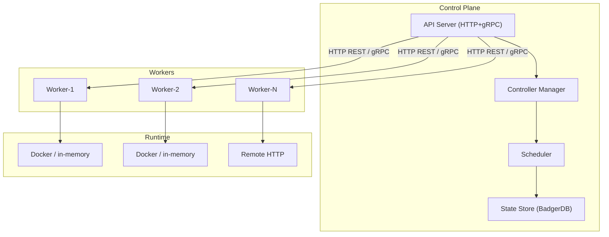

# Distributed Container Orchestration System

A container orchestrator in **pure Go**. Implements scheduling, rolling updates, autoscaling, service discovery, persistent volumes, network policies, RBAC, HA leadership, and observability.

## Architecture



See [docs/ARCHITECTURE.md](docs/ARCHITECTURE.md) for details.

## Features

| Feature | Details |
|---|---|
| **Scheduling** | Least-loaded, best-fit, affinity/anti-affinity, priority preemption |
| **Deployments** | Rolling updates, canary, revision history, rollback |
| **Autoscaling** | CPU/memory/custom metrics with cooldowns |
| **Health** | Node TTL, liveness/readiness probes, auto-rollback |
| **Services** | Endpoint reconciliation, round-robin/least-connections LB |
| **DNS** | Embedded UDP, `<name>.default.svc.cluster.local` resolution |
| **Storage** | PersistentVolume/Claim binding, stateful workloads |
| **Network** | NetworkPolicy with peer/namespace filtering |
| **Secrets** | AES-GCM encryption at rest |
| **Jobs** | One-time and scheduled jobs with retry/backoff |
| **RBAC** | Role bindings with authorization |
| **HA** | Leader election with shard-aware reconciliation |
| **Auth** | Static token, JWT, OIDC/JWKS |
| **Observability** | Prometheus + Grafana dashboards |

## Quick Start

**Prerequisites:** Go 1.21+, Docker Compose

```bash
# Build
go build -mod=mod ./...

# Test
go test -mod=mod ./...

# Run stack
docker compose up -d --build

# Verify
curl http://localhost:8080/healthz

# Create deployment
curl -X POST http://localhost:8080/v1/deployments \
  -H "Authorization: Bearer dev-token" \
  -H "Content-Type: application/json" \
  -d '{
    "spec": {
      "name": "web",
      "image": "nginx:latest",
      "replicas": 2,
      "resources": { "milliCPU": 250, "memoryMB": 256 }
    }
  }'
```

## REST API

| Method | Path | Description |
|---|---|---|
| POST | `/v1/deployments` | Create deployment |
| GET | `/v1/deployments` | List deployments |
| PUT | `/v1/deployments/{id}` | Update deployment |
| DELETE | `/v1/deployments/{id}` | Delete deployment |
| POST | `/v1/deployments/{id}/rollback` | Rollback deployment |
| GET | `/v1/services` | List services |
| POST | `/v1/services` | Create service |
| GET | `/v1/cluster` | Cluster state |
| POST | `/v1/nodes/{id}/drain` | Drain node |
| GET | `/v1/events` | Event history |
| GET | `/v1/events/stream` | Live events (SSE) |

Full reference in [docs/TESTING.md](docs/TESTING.md).

## Testing

Run full test suite with race detector:

```bash
go test -race ./...
```

- **46 unit tests** across all packages
- **Integration tests** for core features
- **E2E tests** for full deployment flows
- **Chaos tests** for failure scenarios

See [docs/TESTING.md](docs/TESTING.md) for detailed scenarios.

## Configuration

Key environment variables:

**API Server**
- `ORCH_HTTP_ADDR` — HTTP listen address (default `:8080`)
- `ORCH_AUTH_MODE` — `static` / `jwt` / `oidc` / `hybrid` (default `static`)
- `ORCH_API_TOKEN` — Static bearer token (default `dev-token`)
- `ORCH_DB_PATH` — Persistence directory (default `./badger`)

**Worker**
- `ORCH_WORKER_ID` — Worker node identity
- `ORCH_SERVER_URL` — Control plane address (default `http://localhost:8080`)
- `ORCH_RUNTIME_DRIVER` — `docker` / `inmemory` / `remote-http`

Full reference in [docs/TESTING.md](docs/TESTING.md).

## Observability

- **Prometheus** at `:9091` scrapes metrics from `:8080/metrics` and workers
- **Grafana** at `http://localhost:3000` (admin/admin) with pre-provisioned dashboards
- **Trace IDs** propagated through all requests

## Docs

- [docs/ARCHITECTURE.md](docs/ARCHITECTURE.md) — System design and components
- [docs/TESTING.md](docs/TESTING.md) — Test scenarios and workflows
- [docs/remaining.md](docs/remaining.md) — Implementation status

## Stack

- **Scheduling engine** — Bin packing with labels and preemption
- **Rolling updates** — maxSurge/maxUnavailable with revision tracking
- **Persistence** — BadgerDB with snapshot + AOF log
- **Networking** — DNS, load balancing, network policies
- **Security** — RBAC, mTLS, AES-GCM encryption, audit logging

All tests passing. Live Docker Compose deployment verified.
